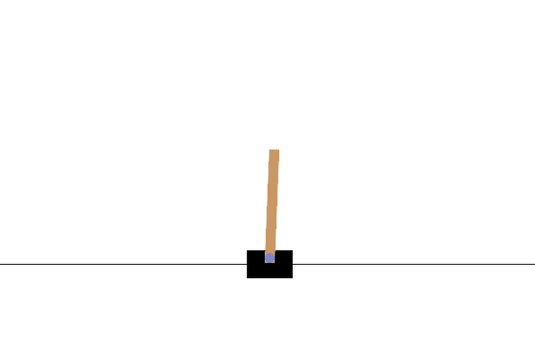

# Introduction to OpenAI Gym



This is an introduction to the OpenAI Gym library. This library can initialise virtual environments that can be used to train reinforcement learning agents.

In these example, the cartpole-v0 environment is initialised and some simple policies (random and hardcoded) are defined and applied to the problem.

Please refer to [this article](https://www.datasparked.com/reinforcement%20learning/Introduction-to-openAI-gym/) for more information.


# Installation

```bash
pip install gym
```

# Run the code

```bash
python cartpole_simple_policies.py
```