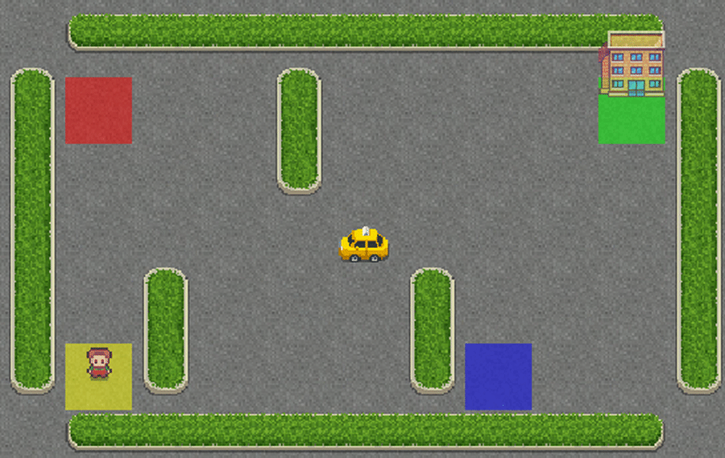

# Q learning for discrete observation space

This code illustrates how to apply Q learning to solve problems (Taxi-v3 environment) with discrete observation spaces.

Please refer to [this article](https://www.datasparked.com/reinforcement%20learning/Q-learning-for-discrete-state-problems/) for more information.

