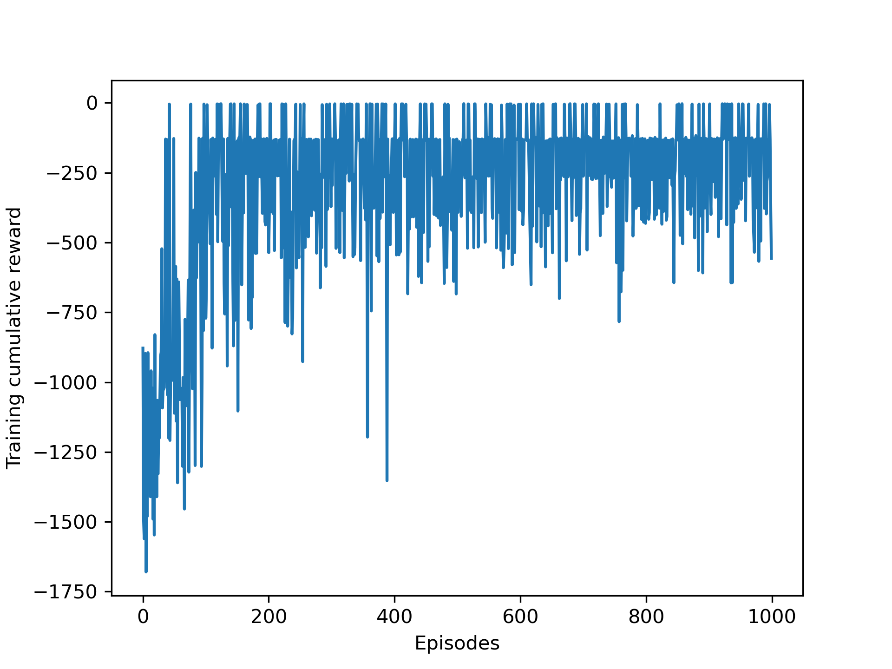

# Q learning for continuous observation space and action space

This code illustrates how to apply Q learning to solve problems (Pendulum-v0 environment) with continuous observation and action space.

Please refer to [this article](https://www.datasparked.com/reinforcement%20learning/Q-learning-for-continuous-state-problems/) for more information.

